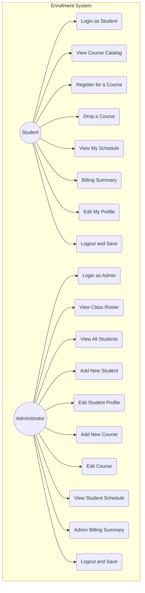
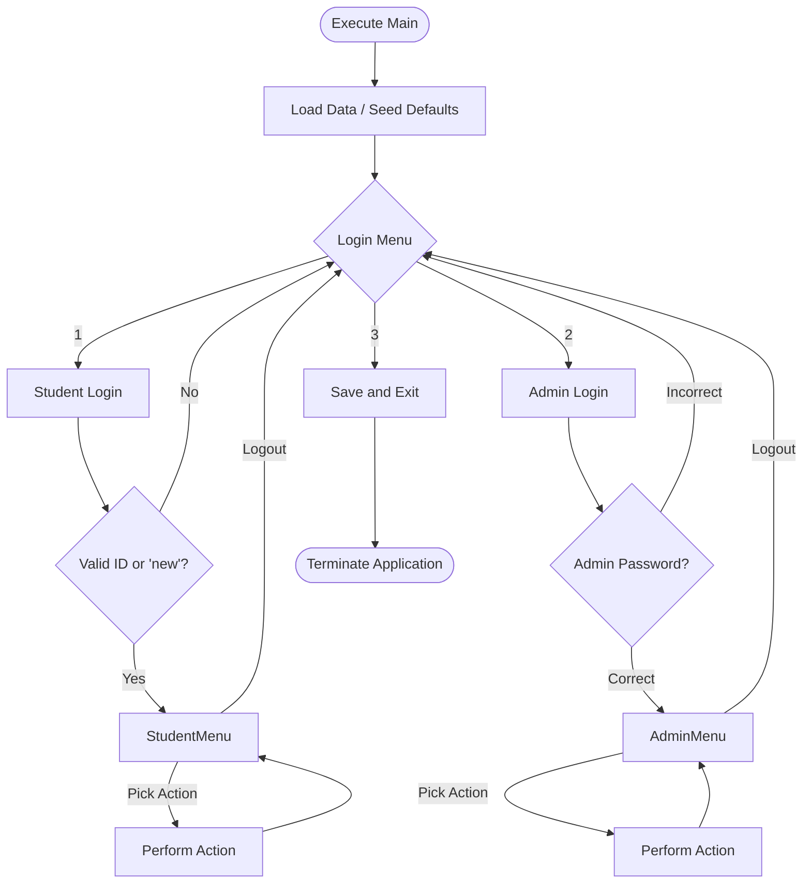

# unknownapp
This is an unknown application written in Java

---- For Submission (you must fill in the information below) ----
### Use Case Diagram

### Flowchart of the main workflow

### Prompts

Below are the prompts used to assist with generating the Python counterpart logic for Task 5:

1. *"Based on the Java `EnrollmentSystem` logic, Can you implement the 'Register for a use case and a simplifed Python code that represent the original one. Without having Gson file structure and let the user enter their Student ID, display the course catalog, and test the constraints (Capacity, Prerequisites, Time Conflict). Make it run via command-line until the user quits."*
